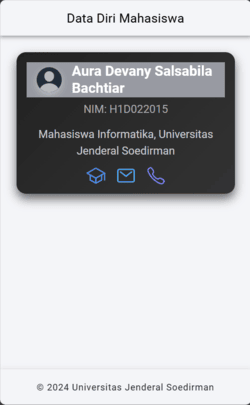

# Tugas 6 - Pertemuan 7

Nama : Aura Devany Salsabila Bachtiar

NIM : H1D022015

Shift Baru: Shift C

### Pertanyaan

Bagaimana cara untuk menambahkan Komponen di halaman Ionic? Jelaskan secara detail langkahnya.

### Jawaban

1. Instalasi Ionic Framework

   Pastikan Node.js sudah terinstal di sistem. Instal Ionic CLI.
   
2. Buat Project Baru
   
   `ionic start myApp blank` Ini akan membuat project Ionic baru dengan template kosong.
   
3. Tambahkan Komponen ke Halaman
   
   Buka file `src/app/home/home.page.html`, yang akan digunakan untuk menambahkan komponen.

   Tambahkan komponen ke dalam halaman ini.

   Komponen-komponen yang akan ditambahkan misalnya meliputi Ion Header, Ion Toolbar, Ion Title, Ion Content, Ion Card, dan Ion Icon.

   Ion Header dan Ion Toolbar digunakan untuk menampilkan header pada halaman. Ion Card digunakan untuk menampilkan informasi dalam bentuk card, yang dalam contoh ini berisi informasi mahasiswa. Ion Avatar menampilkan gambar profil mahasiswa. Ion Icon digunakan untuk menambahkan ikon-ikon yang mewakili informasi seperti sekolah, email, dan telepon.
   
4. Atur Styling (Opsional)
   
   Untuk mempercantik tampilan, tambahkan komponen dengan menggunakan CSS. Ionic mendukung CSS dan SCSS untuk styling. Buka file `home.page.scss` untuk menambahkan gaya custom.

   CSS digunakan untuk menambahkan efek seperti hover, shadow, dan animasi pada ikon dan kartu agar tampilan lebih dinamis.
  
5. Jalankan Aplikasi
   
    Untuk melihat perubahan yang sudah Anda buat, jalankan aplikasi menggunakan perintah `ionic serve`

Hasil Akhir

   Setelah menjalankan aplikasi, akan menampilkan halaman yang berisi informasi mahasiswa yaitu nama dan nim yang dilengkapi dengan icon.

## Screenshot

   
